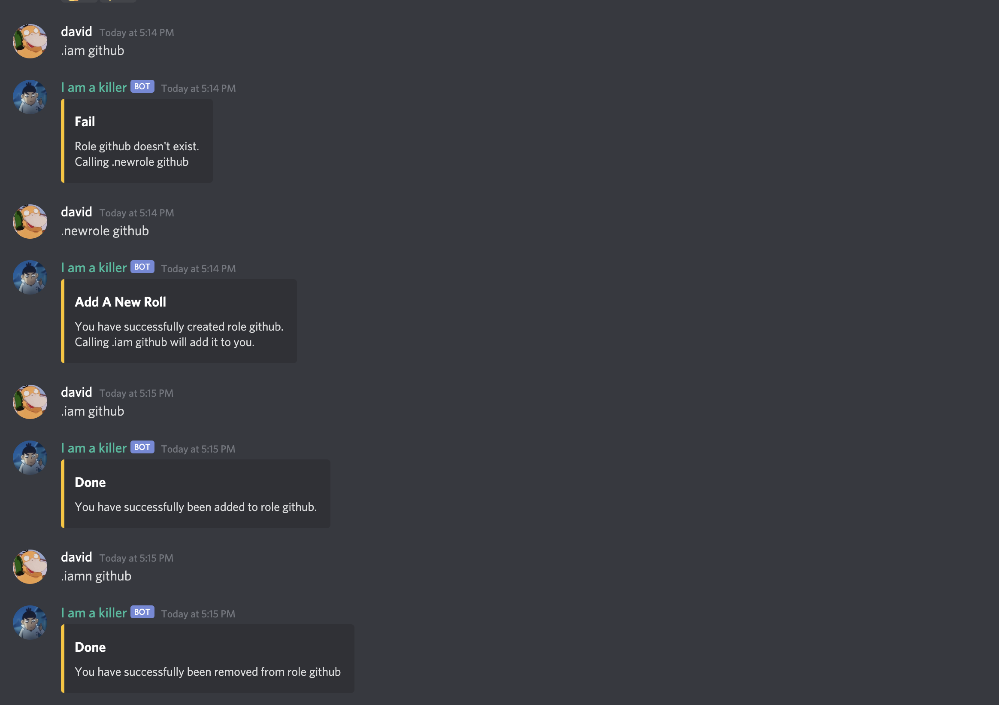

<h1> discordBot</h1>
A simple discord bot wrote in node.js  
<h2>Overview</h2>
</img>
<h2>How to use it</h2>
<ul>
  <li>.ls -- list all the commands</li>
  <li>.ping -- pong!</li>
  <li>.hello -- hello world</li>
  <li>.iam -- adds a role to the caller</li>
  <li>.iamn -- removes a role from the caller</li>
  <li>.newrole -- creates a new role to the server</li>
  <li>.7 -- generates a random gif from 3 options</li>
  <li>.clear -- removes message in 14 days</li>
</ul>
